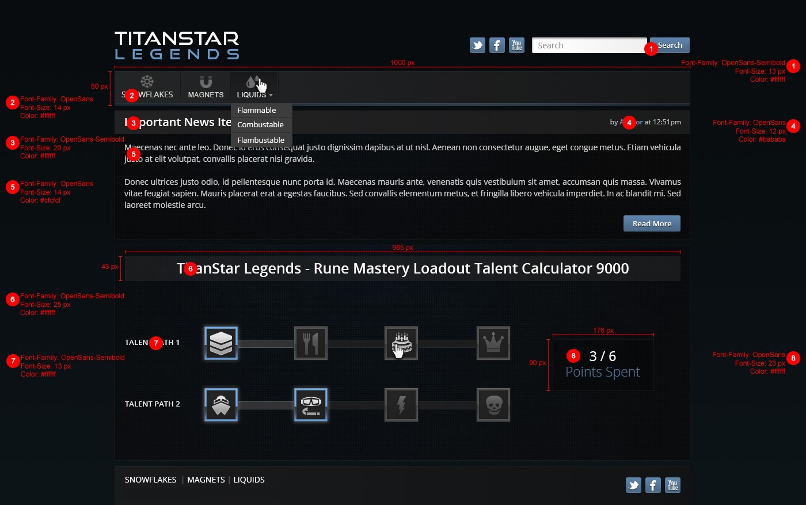
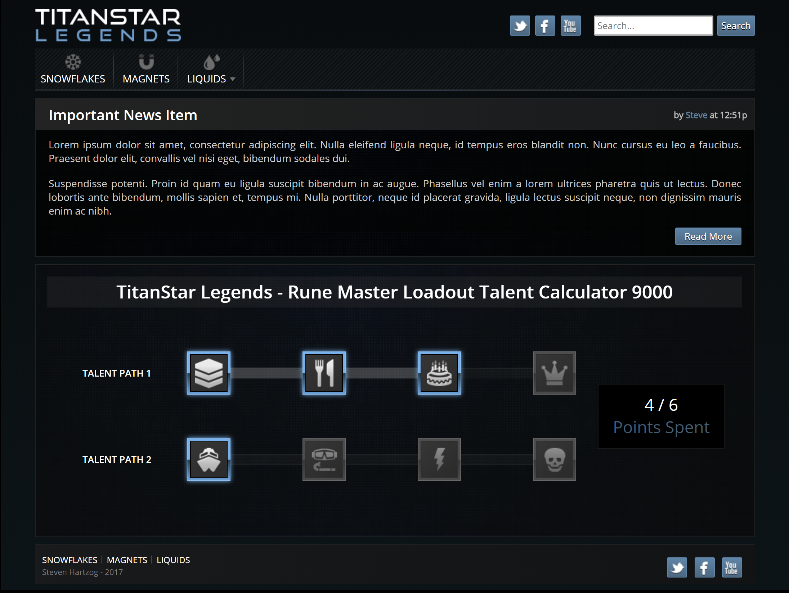

# Design Prototype

> **NOTE**: I originally used express-sass-middleware to serve the SASS stylesheet dynamically as styles.css. Between a new machine and 6-8mos... somehow this no longer works in Node 9.x without Python & C++ (??!?!), so I migrated it to node-sass-middleware, which doesn't appear to support on-the-fly compilation and serving - so I had to update my index to `/app/out/styles.css`. Other than that, this code is straight from July 2017.

```JavaScript
// Install
npm i

// Start
npm start
```

## What is this?

A design prototype I did last year for a possible employer. I thought I did well, so I'm adding here as an example of my work.

## The Original Design



## My Thoughts

### What I like

- By design you can't unselect something earlier in your skill tree. This is great for preventing accidental clicks completely undoing your build.
- I DO like the news banner gradients and the selected talent gradient boxes. Really cool looking (and the first time I had done that)!
- In fact, most things have depth here... something that is so often ignored by designers I've worked with.

### What I don't like

- The original design specs called for a shift-click to unselect the talents (which I missed). Instead I did it in a more intuitive (to me) way of just clicking it again.
- I don't particularly like the inset header in the content below the "important news" banner box.
- I don't like the weird herringbone(?) background of the main menu, nor the abrubt (no border) start and end (left and right).
- There was no responsive layout required so no @media queries. Truly sad how some designers force static layouts on developers. I ended up using flexbox for the skill trees. I personally love flexbox, **hate** floats and just tried grid layouts yesterday (1/4/2017) for a student of mine, and am very excited to work with grid in the future.
- It goes without saying that this is not touch friendly (something that is increasingly important in app design).
- I received ZERO feedback on my code. Just a terse 'not interested' from the customer and then they went dark. Honestly, I still love the team (and would still love to work with them) but it is disappointing that they had nothing to say... at all.

## My Work

